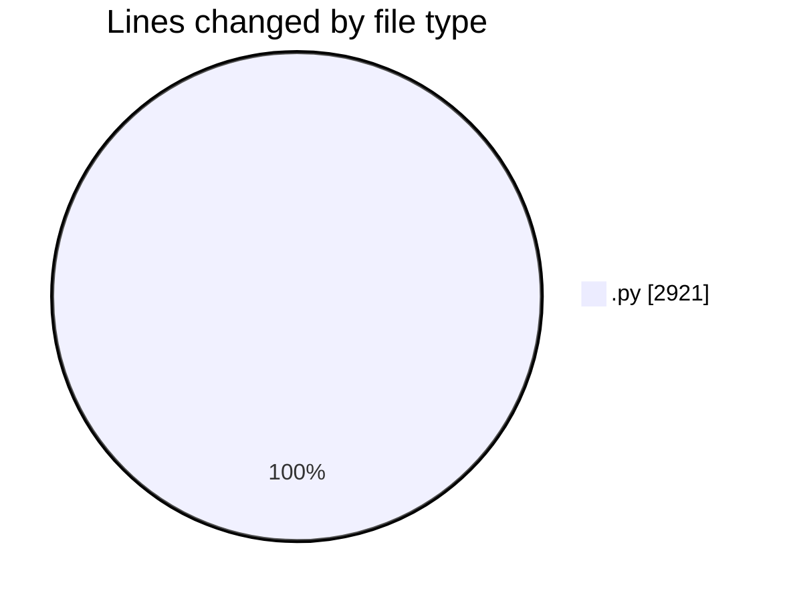
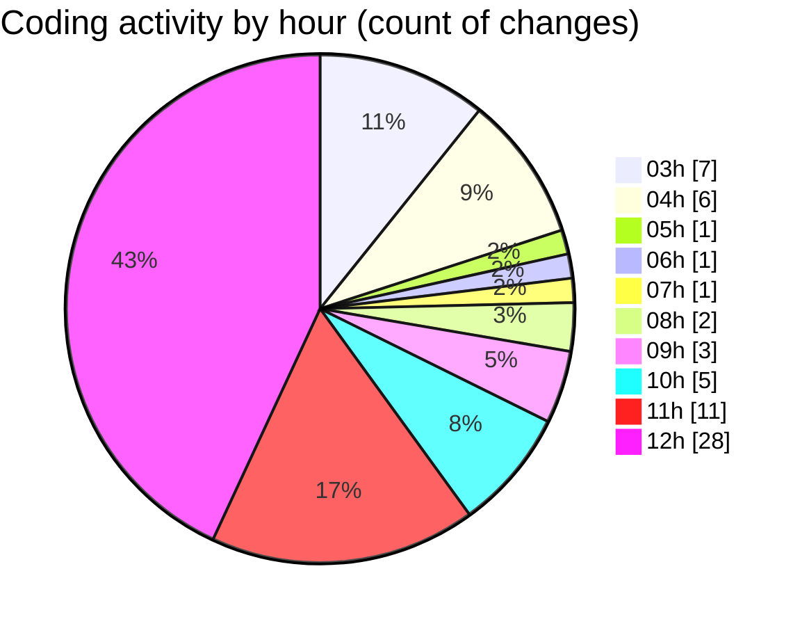

# Cursor - Activity Summary 

## Overall Statistics

| Stat                   | Value                                                             |
| ---------------------- | ----------------------------------------------------------------- |
| **Lines Added** (➕)   | 2306                                          |
| **Lines Removed** (➖) | 615                                        |
| **Net Change** (↕)    | 1691                |
| **Active Time** (⌚)   | 60 minutes |

## Modified Files
- **login_animado_gradiente.py** (+66, -0)
- **login_animado_linhas.py** (+73, -0)
- **login_moderno.py** (+1201, -615)
- **login_test.py** (+113, -0)
- **settings.py** (+56, -0)
- **font_manager.py** (+49, -0)
- **particles.py** (+75, -0)
- **left_panel.py** (+228, -0)
- **right_panel.py** (+232, -0)
- **login_window.py** (+111, -0)
- **main.py** (+97, -0)
- **__init__.py** (+1, -0)
- **__init__.py** (+1, -0)
- **__init__.py** (+1, -0)
- **__init__.py** (+1, -0)
- **__init__.py** (+1, -0)

## Visualizations

### By File Type (Lines Changed)

### By Hour (Estimated Activity Count)

> **Last Updated:** 7/2/2025, 12:36:12 PM