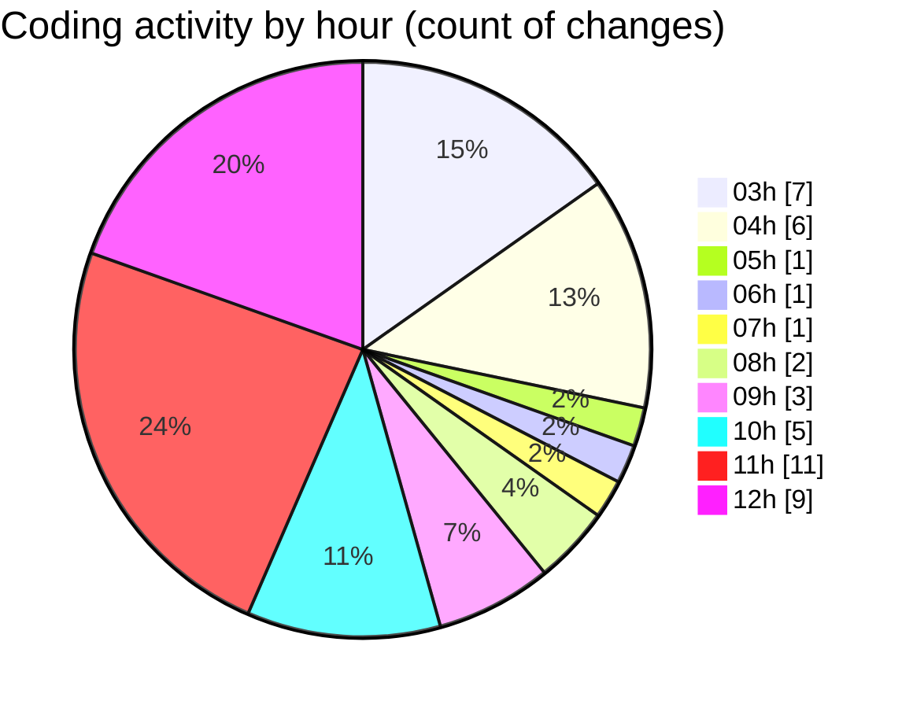

# Cursor - Activity Summary 

## Overall Statistics

| Stat                   | Value                                                             |
| ---------------------- | ----------------------------------------------------------------- |
| **Lines Added** (➕)   | 1453                                          |
| **Lines Removed** (➖) | 615                                        |
| **Net Change** (↕)    | 838                |
| **Active Time** (⌚)   | 41 minutes |

## Modified Files
- **login_animado_gradiente.py** (+66, -0)
- **login_animado_linhas.py** (+73, -0)
- **login_moderno.py** (+1201, -615)
- **login_test.py** (+113, -0)

## Visualizations

### By File Type (Lines Changed)

### By Hour (Estimated Activity Count)

> **Last Updated:** 7/2/2025, 12:26:12 PM