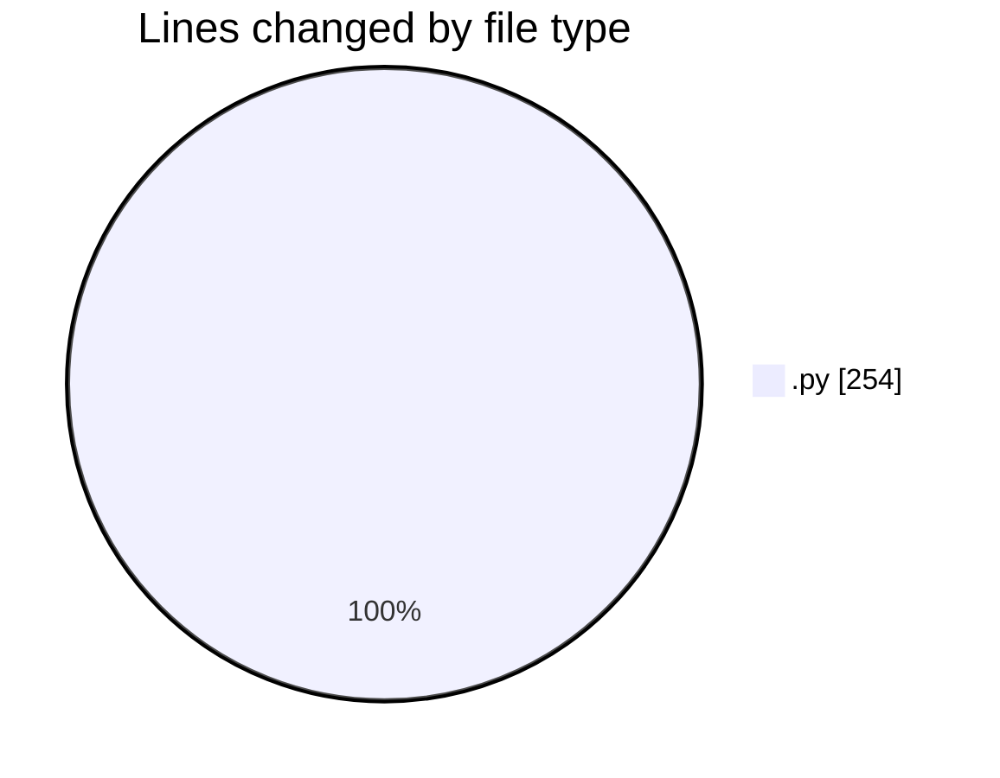
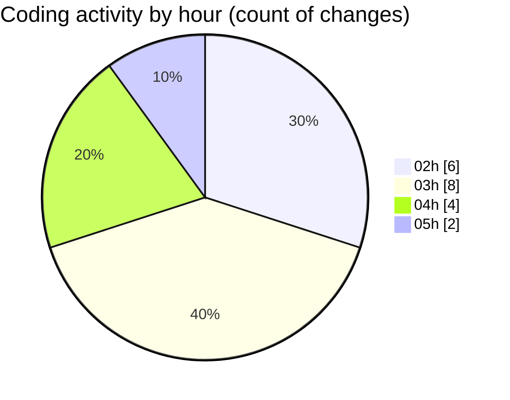

# Cursor - Activity Summary 

## Overall Statistics

| Stat                   | Value                                                             |
| ---------------------- | ----------------------------------------------------------------- |
| **Lines Added** (➕)   | 251                                          |
| **Lines Removed** (➖) | 3                                        |
| **Net Change** (↕)    | 248                |
| **Active Time** (⌚)   | 18 minutes |

## Modified Files
- **__init__.py** (+25, -3)
- **produto.py** (+17, -0)
- **produto_service.py** (+16, -0)
- **cliente.py** (+13, -0)
- **cliente_service.py** (+16, -0)
- **main_backoffice_window.py** (+154, -0)
- **test_backoffice_window.py** (+10, -0)

## Visualizations

### By File Type (Lines Changed)

### By Hour (Estimated Activity Count)

> **Last Updated:** 7/3/2025, 5:53:29 AM