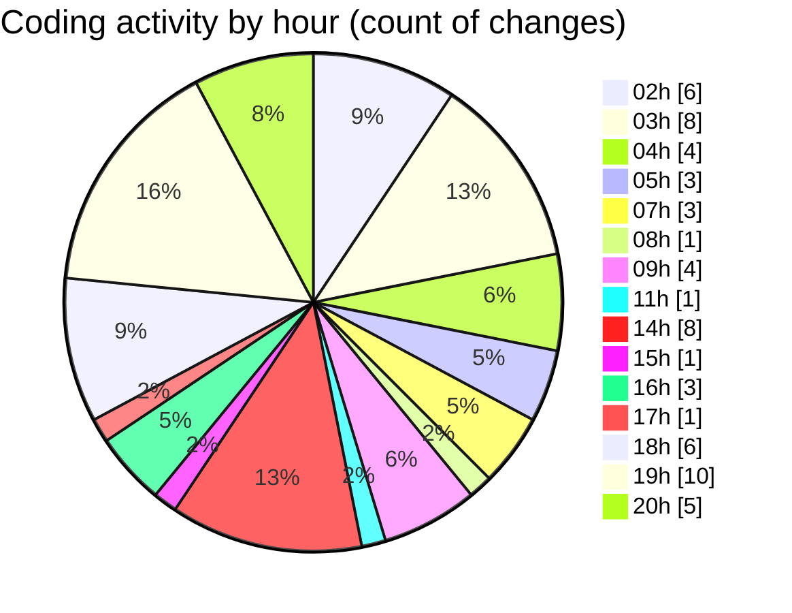

# Cursor - Activity Summary 

## Overall Statistics

| Stat                   | Value                                                             |
| ---------------------- | ----------------------------------------------------------------- |
| **Lines Added** (➕)   | 2750                                          |
| **Lines Removed** (➖) | 6                                        |
| **Net Change** (↕)    | 2744                |
| **Active Time** (⌚)   | 64 minutes |

## Modified Files
- **__init__.py** (+25, -3)
- **produto.py** (+17, -0)
- **produto_service.py** (+16, -0)
- **cliente.py** (+13, -0)
- **cliente_service.py** (+16, -0)
- **main_backoffice_window.py** (+1332, -0)
- **test_backoffice_window.py** (+20, -0)
- **main.py** (+285, -0)
- **add_python_to_path.bat** (+52, -0)
- **settings.py** (+57, -0)
- **add_python_to_path.bat** (+26, -0)
- **font_manager.py** (+49, -0)
- **left_panel.py** (+228, -0)
- **right_panel.py** (+232, -0)
- **login_window.py** (+111, -0)
- **run_alpha_erp.bat** (+20, -3)
- **config.py** (+183, -0)
- **database.py** (+50, -0)
- **auth_service.py** (+18, -0)

## Visualizations

### By File Type (Lines Changed)

### By Hour (Estimated Activity Count)

> **Last Updated:** 7/3/2025, 8:55:22 PM