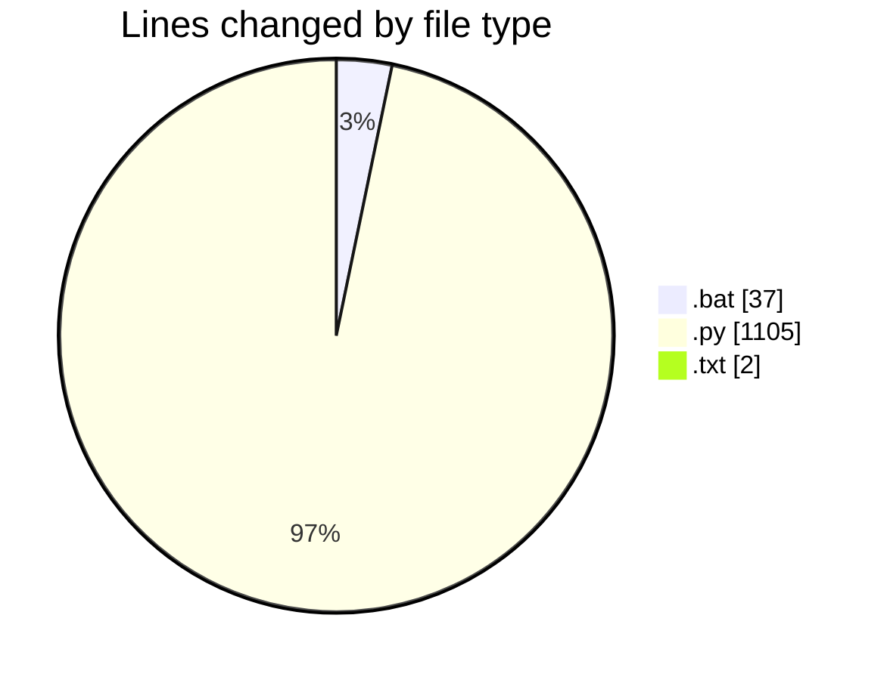
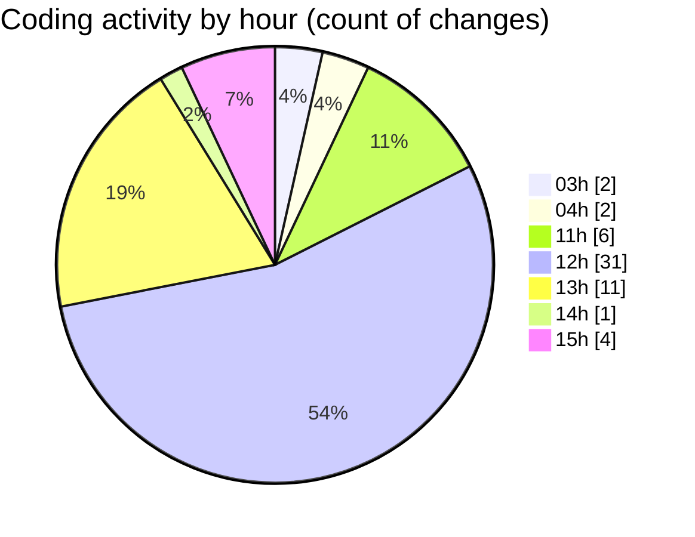

# Cursor - Activity Summary 

## Overall Statistics

| Stat                   | Value                                                             |
| ---------------------- | ----------------------------------------------------------------- |
| **Lines Added** (➕)   | 1034                                          |
| **Lines Removed** (➖) | 110                                        |
| **Net Change** (↕)    | 924                |
| **Active Time** (⌚)   | 80 minutes |

## Modified Files
- **fechar_programas_alpha.bat** (+11, -0)
- **fechar_programas_alpha_forcado.bat** (+26, -0)
- **login_window.py** (+133, -1)
- **left_panel.py** (+270, -0)
- **font_manager.py** (+61, -0)
- **right_panel.py** (+331, -103)
- **run_login.py** (+28, -0)
- **test_pyqt.py** (+6, -0)
- **left_panel.py** (+32, -0)
- **right_panel.py** (+34, -0)
- **login_window.py** (+16, -0)
- **run_login.py** (+9, -0)
- **requirements.txt** (+1, -0)
- **requirements.txt** (+1, -0)
- **run_login.py** (+18, -0)
- **settings.py** (+57, -6)

## Visualizations

### By File Type (Lines Changed)

### By Hour (Estimated Activity Count)

> **Last Updated:** 7/4/2025, 3:23:11 PM