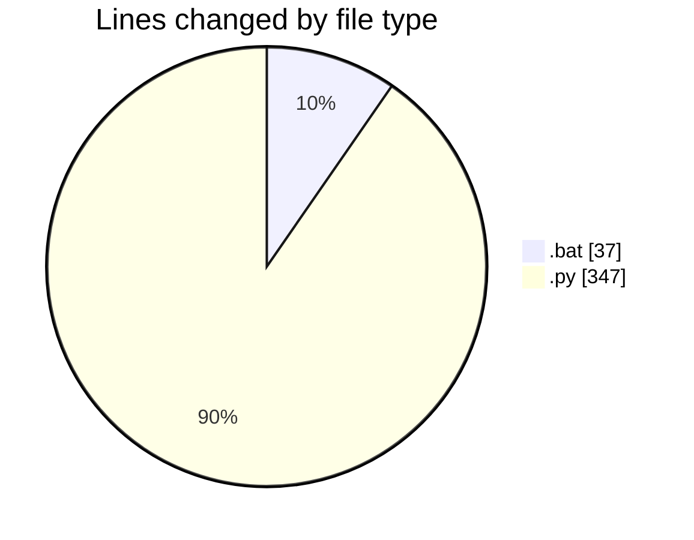
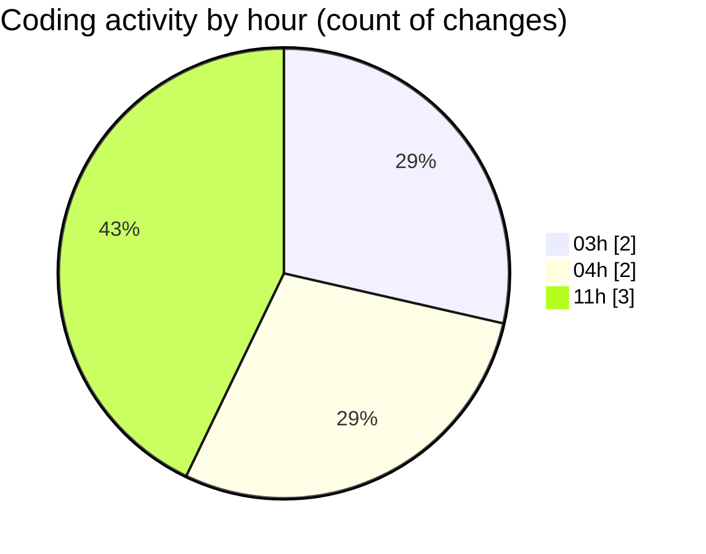

# Cursor - Activity Summary 

## Overall Statistics

| Stat                   | Value                                                             |
| ---------------------- | ----------------------------------------------------------------- |
| **Lines Added** (➕)   | 384                                          |
| **Lines Removed** (➖) | 0                                        |
| **Net Change** (↕)    | 384                |
| **Active Time** (⌚)   | 9 minutes |

## Modified Files
- **fechar_programas_alpha.bat** (+11, -0)
- **fechar_programas_alpha_forcado.bat** (+26, -0)
- **login_window.py** (+119, -0)
- **left_panel.py** (+228, -0)

## Visualizations

### By File Type (Lines Changed)

### By Hour (Estimated Activity Count)

> **Last Updated:** 7/4/2025, 11:53:11 AM