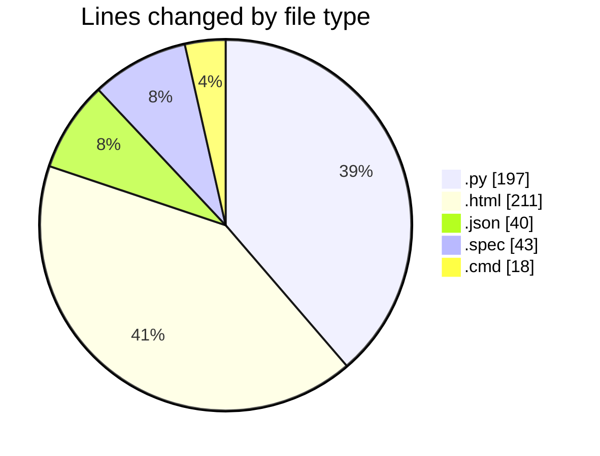
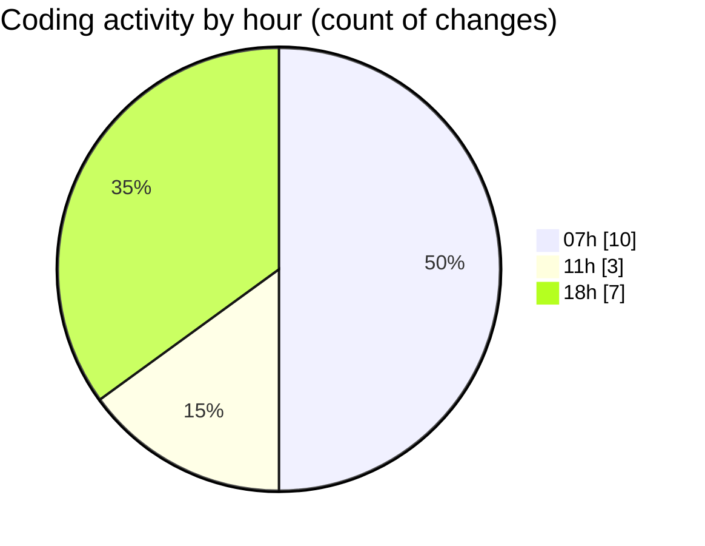

# Cursor - Activity Summary 

## Overall Statistics

| Stat                   | Value                                                             |
| ---------------------- | ----------------------------------------------------------------- |
| **Lines Added** (➕)   | 509                                          |
| **Lines Removed** (➖) | 0                                        |
| **Net Change** (↕)    | 509                |
| **Active Time** (⌚)   | 19 minutes |

## Modified Files
- **routes.py** (+193, -0)
- **index.html** (+211, -0)
- **package.json** (+40, -0)
- **launcher.py** (+4, -0)
- **erp_backend.spec** (+43, -0)
- **start.cmd** (+18, -0)

## Visualizations

### By File Type (Lines Changed)

### By Hour (Estimated Activity Count)

> **Last Updated:** 7/12/2025, 6:06:34 PM