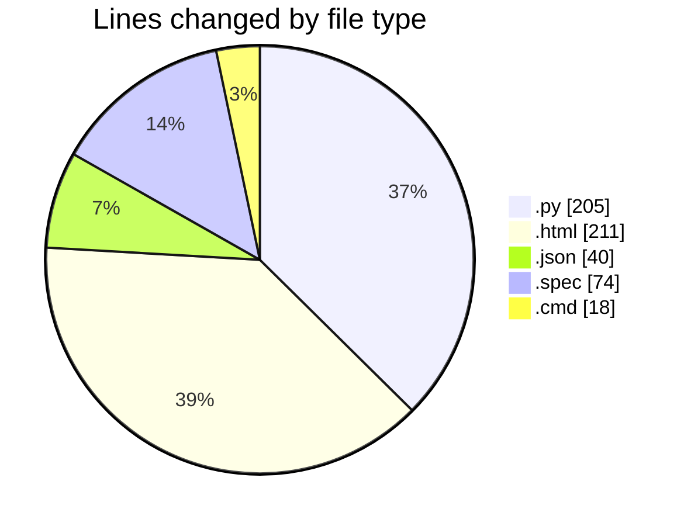
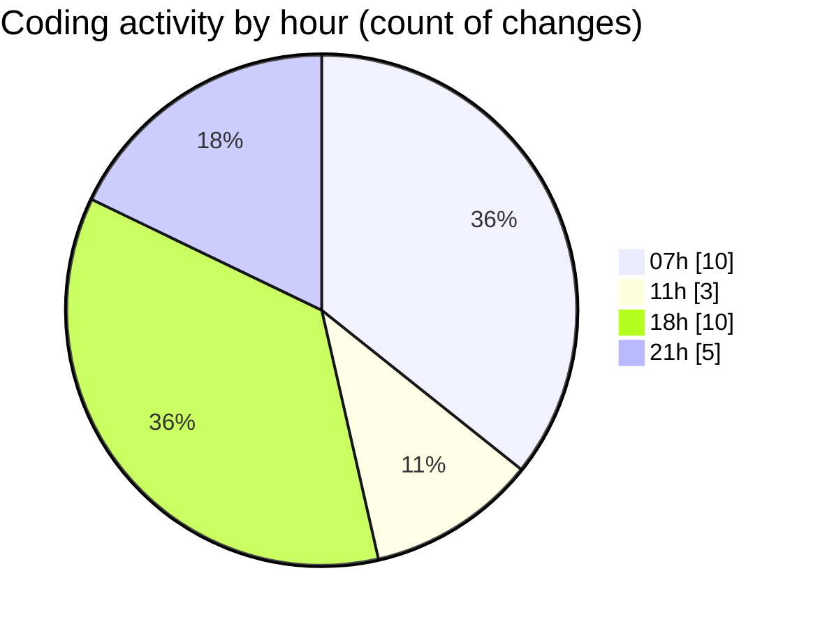

# Cursor - Activity Summary 

## Overall Statistics

| Stat                   | Value                                                             |
| ---------------------- | ----------------------------------------------------------------- |
| **Lines Added** (➕)   | 547                                          |
| **Lines Removed** (➖) | 1                                        |
| **Net Change** (↕)    | 546                |
| **Active Time** (⌚)   | 29 minutes |

## Modified Files
- **routes.py** (+193, -0)
- **index.html** (+211, -0)
- **package.json** (+40, -0)
- **launcher.py** (+12, -0)
- **erp_backend.spec** (+73, -1)
- **start.cmd** (+18, -0)

## Visualizations

### By File Type (Lines Changed)

### By Hour (Estimated Activity Count)

> **Last Updated:** 7/12/2025, 10:01:34 PM