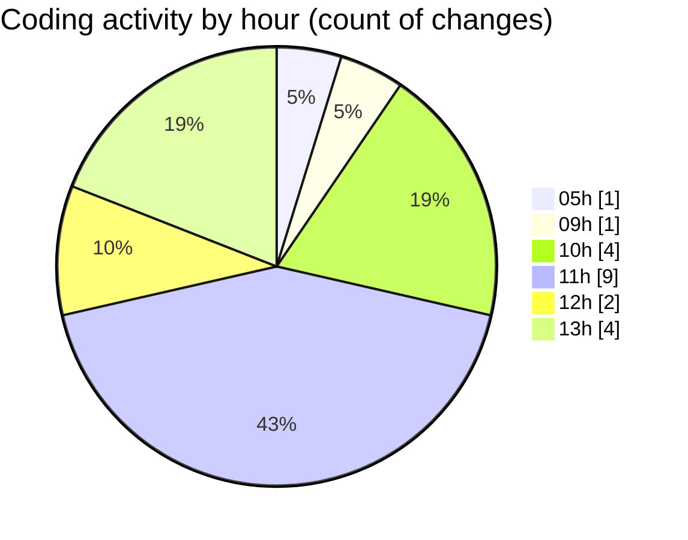

# Cursor - Activity Summary 

## Overall Statistics

| Stat                   | Value                                                             |
| ---------------------- | ----------------------------------------------------------------- |
| **Lines Added** (➕)   | 439                                          |
| **Lines Removed** (➖) | 0                                        |
| **Net Change** (↕)    | 439                |
| **Active Time** (⌚)   | 22 minutes |

## Modified Files
- **launcher.py** (+1, -0)
- **routes.py** (+271, -0)
- **test_api.py** (+62, -0)
- **product.py** (+22, -0)
- **schemas.py** (+46, -0)
- **database.py** (+18, -0)
- **cursor.json** (+3, -0)
- **movimentacao_estoque.py** (+16, -0)

## Visualizations

### By File Type (Lines Changed)

### By Hour (Estimated Activity Count)

> **Last Updated:** 7/13/2025, 1:24:51 PM