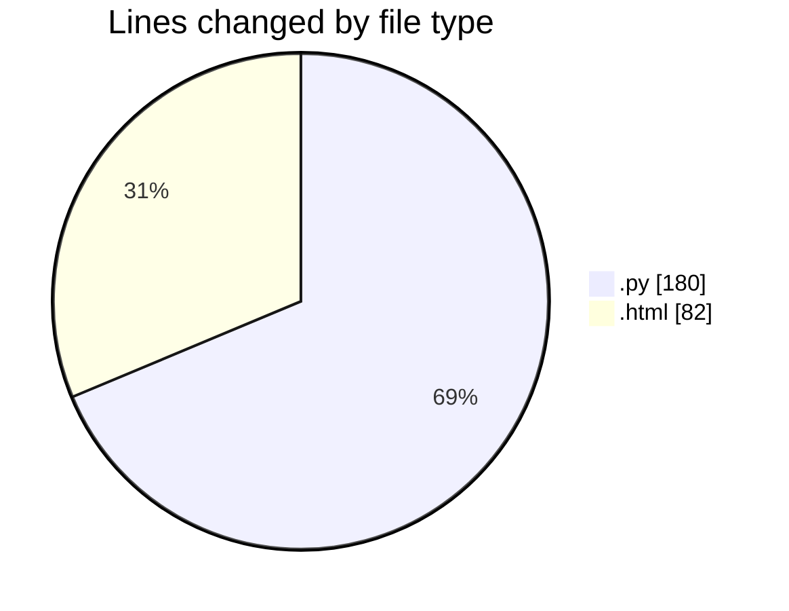
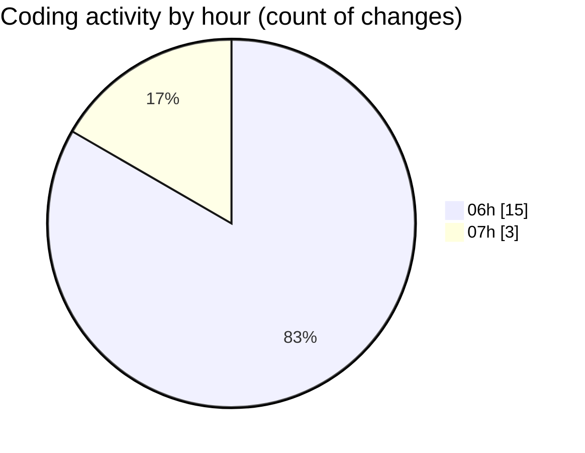

# Projeto Sistema - Activity Summary 

## Overall Statistics

| Stat                   | Value                                                             |
| ---------------------- | ----------------------------------------------------------------- |
| **Lines Added** (➕)   | 260                                          |
| **Lines Removed** (➖) | 2                                        |
| **Net Change** (↕)    | 258                |
| **Active Time** (⌚)   | 13 minutes |

## Modified Files
- **admin_routes.py** (+66, -0)
- **main.py** (+28, -0)
- **dashboard.html** (+40, -0)
- **licenses.html** (+42, -0)
- **license.py** (+45, -2)
- **__init__.py** (+2, -0)
- **main.py** (+37, -0)

## Visualizations

### By File Type (Lines Changed)

### By Hour (Estimated Activity Count)

> **Last Updated:** 7/17/2025, 7:50:07 AM