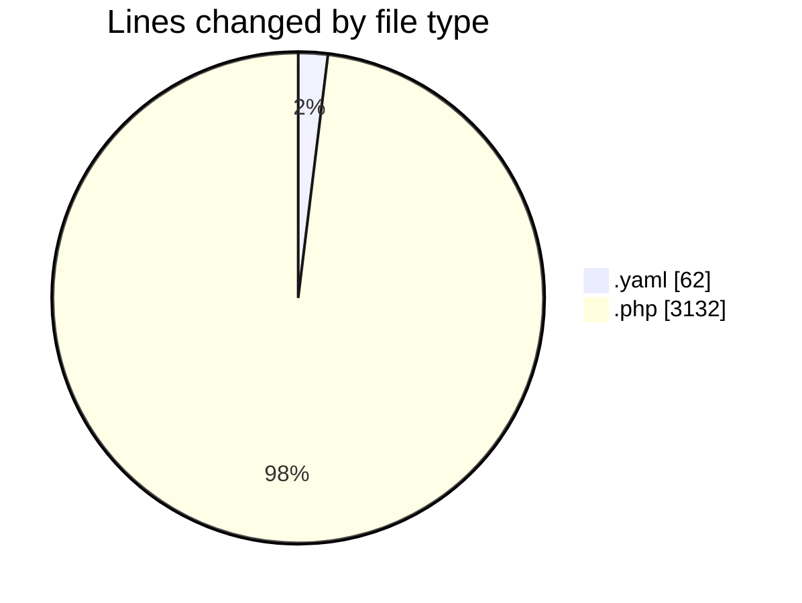
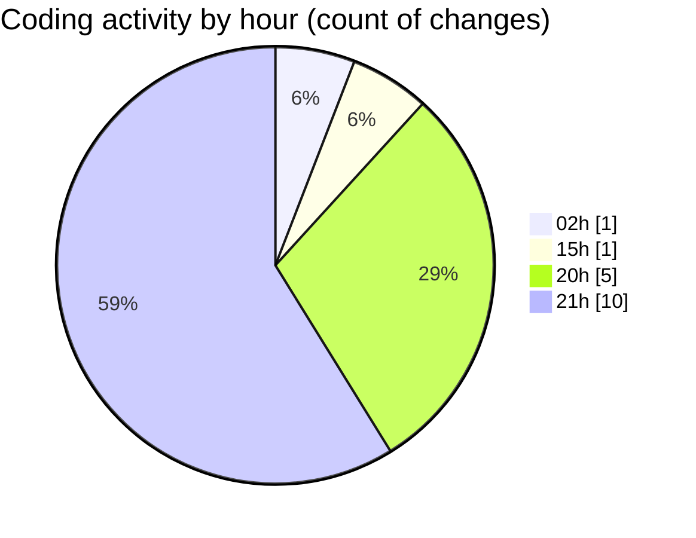

# erp-alpha - Activity Summary 

## Overall Statistics

| Stat                   | Value                                                             |
| ---------------------- | ----------------------------------------------------------------- |
| **Lines Added** (➕)   | 3194                                          |
| **Lines Removed** (➖) | 0                                        |
| **Net Change** (↕)    | 3194                |
| **Active Time** (⌚)   | 14 minutes |

## Modified Files
- **trunk.yaml** (+62, -0)
- **License.php** (+446, -0)
- **index.blade.php** (+366, -0)
- **edit.blade.php** (+292, -0)
- **license-error.blade.php** (+214, -0)
- **admin.php** (+294, -0)
- **ShowInSettings.php** (+78, -0)
- **license.php** (+111, -0)
- **general.php** (+314, -0)
- **settings.php** (+213, -0)
- **LicenseService.php** (+666, -0)
- **AlphaLicenseMiddleware.php** (+138, -0)

## Visualizations

### By File Type (Lines Changed)

### By Hour (Estimated Activity Count)

> **Last Updated:** 9/5/2025, 9:04:11 PM